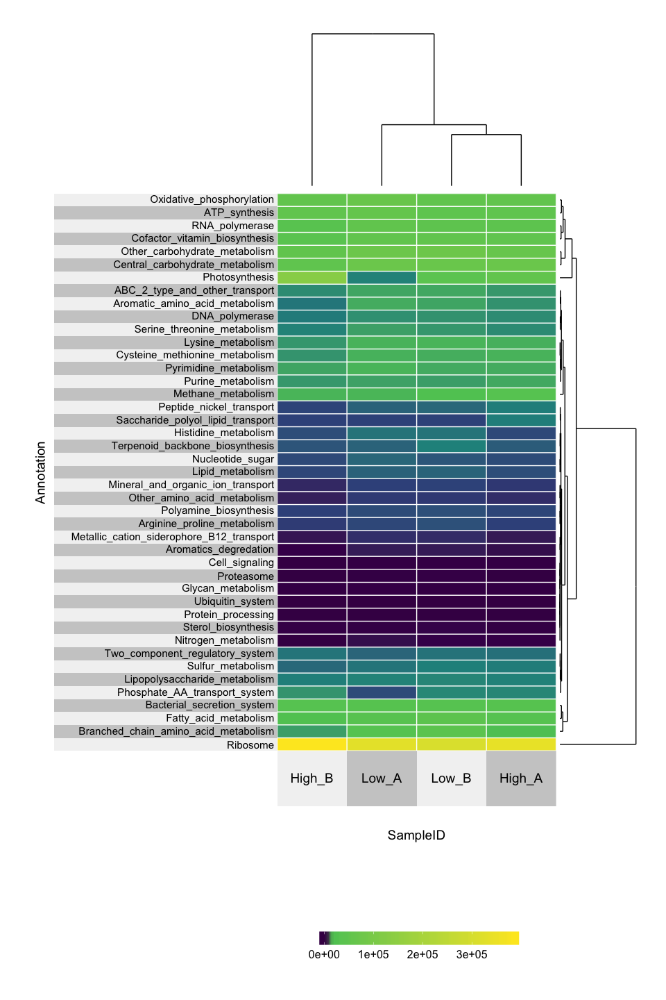

Speeding-up-science-metatranscriptomics-function-summary
================
Zeya Xue
5/10/2019

Speeding up science metatranscriptomics taxa summary
====================================================

-   Written by Zhengyao "Zeya" Xue, [ORCID](https://orcid.org/0000-0002-4930-8212)
-   The data files and R scripts can be found in this [GitHub repo](https://github.com/zeyaxue/speeding-up-science-binder)
-   [Launch Binder](https://mybinder.org/v2/gh/zeyaxue/speeding-up-science-binder/master?urlpath=rstudio)
-   [html version](https://github.com/zeyaxue/speeding-up-science-binder/blob/master/taxa-summary.md)

-   Thumbnail of expected Heatmap


-   P.S. The demonstration shown here is using data from [this paper](https://aem.asm.org/content/84/1/e02026-17.short)

Introduction
------------

The starting point of the workflow is a normailzed KEGG module table

    ##                 KEGG_module    Low_A    Low_B   High_A    High_B
    ## 1       Nitrogen_metabolism   399.25   199.20   130.59      0.00
    ## 2        Methane_metabolism 17121.72 20633.81 31785.74  16822.52
    ## 3         Sulfur_metabolism  5320.98  6077.40  5762.23   4580.87
    ## 4            Photosynthesis  6553.32 40847.12 55201.64 129825.94
    ## 5             ATP_synthesis 58850.99 45995.37 49470.13  50600.52
    ## 6 Oxidative_phosphorylation 67116.60 54022.28 55510.65  54980.40

Load packages and setting up
----------------------------

``` r
library(superheat)
```

Import normalized KEGG module file
----------------------------------

``` r
# The otu table slot of phyloseq object 
KeggTPM <- read.table(file.path("example_data/KEGG_module_TPM.tsv"),
                      header = TRUE, sep = "\t")
row.names(KeggTPM) <- KeggTPM$KEGG_module
KeggTPM <- KeggTPM[,-1]
KeggTPM <- as.matrix.data.frame(KeggTPM)
```

Heat map
--------

``` r
superheat(KeggTPM,
          # retain original order of rows/cols
          pretty.order.rows = TRUE,
          pretty.order.cols = TRUE,
          row.dendrogram = TRUE,
          col.dendrogram = TRUE,
          grid.hline = TRUE,
          row.title = "Annotation",
          column.title = "SampleID",
          left.label.text.size = 4,
          bottom.label.text.size = 5,
          left.label.size = 0.8,
          # change the grid color to white (more pretty on a dark background)
          grid.hline.col = "white",
          grid.vline.col = "white") 
```

    ## Warning: package 'bindrcpp' was built under R version 3.4.4


